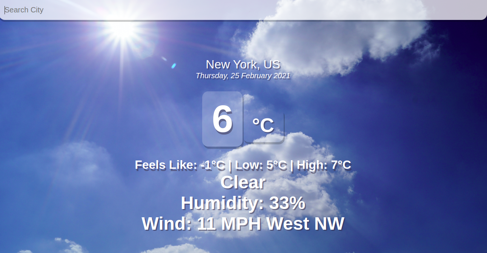

## About

This project was bootstrapped with [Create React App](https://github.com/facebook/create-react-app).

This is a weather app that allows users to enter a city name and receive the current temperature, weather, humidity, wind speed, etc.

This app makes use of the Open Weather Map API: (https://api.openweathermap.org/).

## How to run the application on your local machine

### Clone app into your local machine

### `git clone https://github.com/tonyern/react-weather-app.git`

Go into your machine's terminal and navigate to a directory where you want this app to save in.

### `npm install axios`

Run this command within the app's directory. 
Axios is a dependency the app needs to connect and retrieve weather data from the OpenWeatherMap API.

### `npm start`

Runs this command within the app's directory. 
Open [http://localhost:3000](http://localhost:3000) to view it in the browser.
